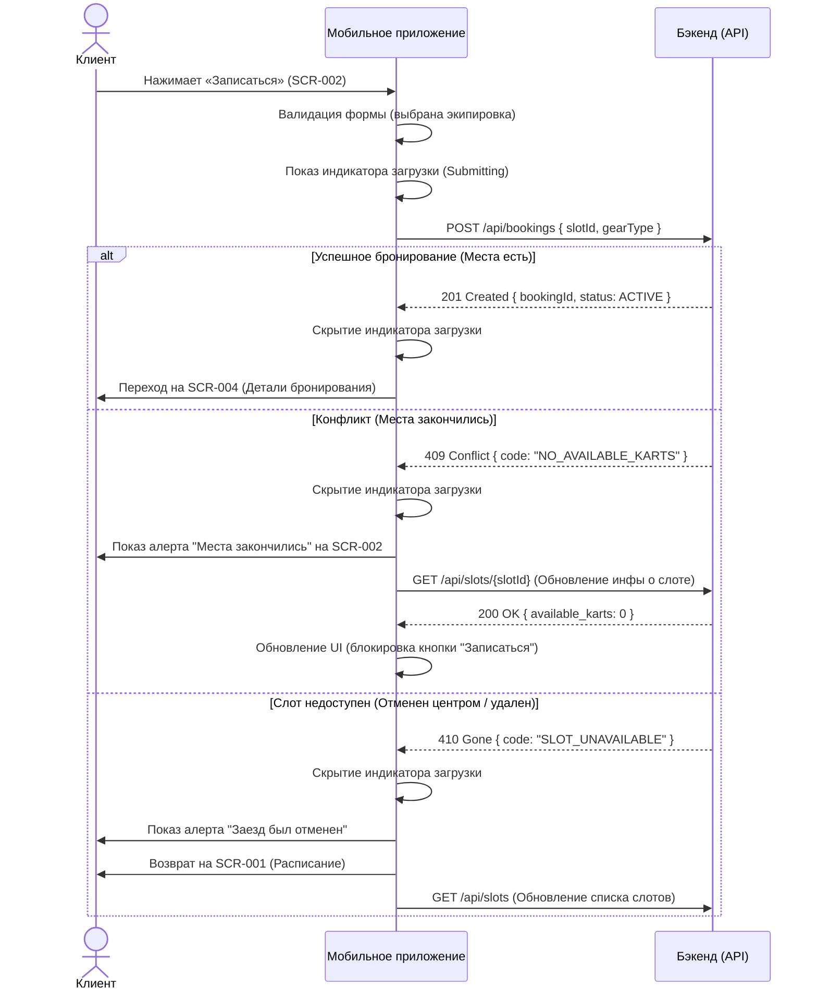

# ER-модель и диаграммы последовательности (Архитектура клиента)

В данном документе описана модель данных клиентского мобильного приложения и диаграмма последовательности для ключевого процесса — создания бронирования заезда.

## 1. ER-модель (в контексте клиентского приложения)

Важно: Клиентское приложение не является мастером-источником большинства данных. Оно выступает как потребитель (Consumer) API.

### Сущности от сервера (Read-Only)
Эти данные приходят от бэкенда и не могут быть изменены клиентом напрямую (только через вызов соответствующих API-методов, если это предусмотрено).

*   **Slot (Заезд)**
    *   `id`: UUID
    *   `start_time`: DateTime
    *   `track_config`: Enum (SHORT, LONG)
    *   `marshal`: Object (ID, Name, Avatar, Rating)
    *   `available_karts`: Integer
    *   `max_karts`: Integer
    *   `status`: Enum (SCHEDULED, CANCELLED_BY_WEATHER, COMPLETED)
*   **Booking (Бронирование)**
    *   `id`: UUID
    *   `slot_id`: UUID
    *   `client_id`: UUID
    *   `status`: Enum (ACTIVE, CANCELLED_BY_CLIENT, CANCELLED_BY_CENTER, COMPLETED)
    *   `gear_type`: Enum (OWN, RENTAL)
*   **ClientProfile (Профиль клиента)**
    *   `id`: UUID
    *   `phone`: String
    *   `name`: String
    *   `is_regular`: Boolean

### Локальное состояние (Read-Write)
*   **DraftBooking (Черновик бронирования)** — хранится в ОЗУ на экране `SCR-002`.
    *   `slot_id`: UUID
    *   `selected_gear_type`: Enum
*   **FiltersState (Состояние фильтров)** — на экране `SCR-001`.
    *   `selected_date`: Date
    *   `selected_track_config`: Enum

---

## 2. Sequence Diagram: Создание бронирования (createBooking)

Диаграмма описывает взаимодействие между клиентом (пользователем), мобильным приложением и бэкендом (API) при попытке записаться на заезд. 
Бэкенд выступает black-box системой, гарантирующей отсутствие двойных бронирований.

